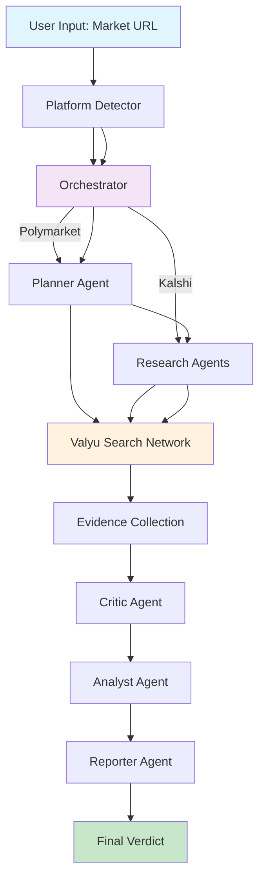
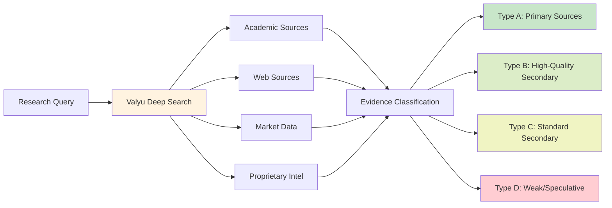
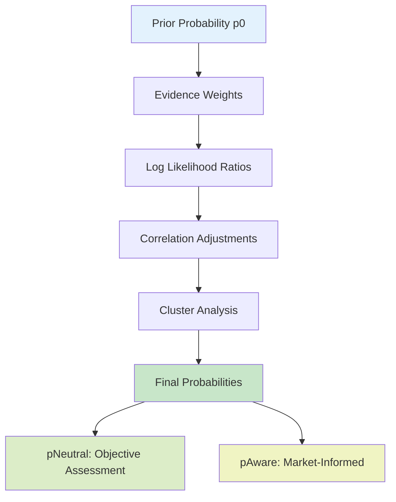

# Omnisense - AI-Powered Prediction Market Analysis

> _Built for HackASU 2025 - Bringing AI-driven insights to prediction markets_

**⚠️ NOT FINANCIAL ADVICE** | Omnisense provides analysis for entertainment and research purposes only. Always DYOR.

## Quick Start

```bash
cd omnis
npm install

# Create .env.local with:
# OPENAI_API_KEY=sk-... # Get from platform.openai.com
# VALYU_API_KEY=vl_...  # Get from platform.valyu.network

npm run dev
```

Open [localhost:3000](http://localhost:3000), paste any **Polymarket or Kalshi** URL, and get your analysis. No signup required in hackathon mode!

---

## 🏆 For HackASU Judges

**Quick Demo Setup (5 minutes):**

1. Make sure you have Node.js installed: `node --version`
2. Navigate to project: `cd omnis`
3. Install dependencies: `npm install`
4. Create `.env.local` with API keys (we'll provide these during judging)
5. Start server: `npm run dev`
6. Open browser: [http://localhost:3000](http://localhost:3000)
7. Paste any Polymarket URL (e.g., `https://polymarket.com/event/presidential-election-winner-2024`)
8. Watch the AI agents work in real-time! 🚀

**Key Demo Points:**

- 🎯 **Multi-Agent System**: Watch 5 AI agents collaborate (Planner → Researcher → Critic → Analyst → Reporter)
- 📊 **Real Research**: See live queries to academic databases and news sources
- 🧮 **Math-Based**: Not just AI vibes - Bayesian probability with evidence weighting
- ⚖️ **Unbiased**: Automatic bilateral research (PRO and CON)
- 💬 **Interactive**: Chat with your completed analysis
- 📄 **Professional**: Export as PDF report

**Sample Markets to Try:**

- Presidential Elections
- Economic Indicators
- Tech Product Launches
- Sports Outcomes

---

## What is Omnisense?

Omnisense is an AI-powered prediction market analysis platform that helps you understand the "why" behind market movements. Built during HackASU 2025, it combines multiple AI agents with real-time research capabilities to provide deep, systematic analysis of prediction markets.

Drop in any **Polymarket or Kalshi** URL and get a structured analysis that breaks down the actual factors driving an outcome. Instead of gut feelings or surface-level takes, you get systematic research across academic papers, news, market data, and expert analysis.

The system uses multiple AI agents to research both sides of a question, then aggregates the evidence using Bayesian probability math. Think of it as having a research team that can read thousands of sources in minutes and give you the key insights.

**Core features:**

- 🤖 **Multi-Agent AI System** - Specialized agents for planning, research, analysis, and reporting
- 📚 **Deep Research** - Access to academic papers, news, and real-time market data via Valyu
- 🎯 **Evidence-Based** - Classification and quality scoring (Type A-D sources)
- 🧮 **Mathematical Rigor** - Bayesian probability aggregation with log-likelihood ratios
- ⚖️ **Bilateral Analysis** - Research both PRO and CON sides to avoid bias
- ⚡ **Real-Time Data** - Fresh information, not stale predictions

Built during **HackASU 2025** to showcase advanced AI agent orchestration in financial analysis.

---

## 🎓 HackASU 2025 Features

### What Makes This Special?

This project was built during HackASU 2025 with several unique innovations:

1. **🧠 Advanced Multi-Agent System**: Five specialized AI agents working in parallel

   - **Planner**: Breaks down complex questions into research pathways
   - **Researcher**: Gathers evidence from academic and web sources (bilateral research)
   - **Critic**: Identifies gaps and recommends follow-up searches
   - **Analyst**: Performs Bayesian probability aggregation
   - **Reporter**: Generates human-readable analysis reports

2. **📊 Mathematical Foundation**: Not just AI vibes - real Bayesian math

   - Log-likelihood ratio calculations
   - Evidence correlation adjustments
   - Cluster analysis for related evidence
   - Type A-D source quality classification

3. **🔍 Deep Research Integration**: Via Valyu's search network

   - Academic papers and research publications
   - Real-time news and market data
   - Expert analysis and proprietary datasets

4. **⚖️ Bias Prevention**: Bilateral research approach
   - Separate PRO and CON research cycles
   - Independent evidence gathering
   - Comprehensive coverage of both sides

### Demo Ready

- ✅ No authentication required - instant analysis
- ✅ Support for Polymarket AND Kalshi markets
- ✅ Beautiful, modern UI with real-time progress tracking
- ✅ Downloadable PDF reports
- ✅ Interactive chat with your analysis

---

## 🏗️ Architecture Overview

Omnisense is built on a **multi-agent AI architecture** that orchestrates specialized agents to conduct deep analysis. Here's how the magic happens:



### 🧠 Agent System Deep Dive

```mermaid
sequenceDiagram
    participant User as 👤 User
    participant Orch as 🎭 Orchestrator
    participant Plan as 🗺️ Planner
    participant Res as 🔍 Researcher
    participant Valyu as 🌐 Valyu Network
    participant Critic as 🧪 Critic
    participant Analyst as 📊 Analyst
    participant Reporter as 📝 Reporter

    User->>Orch: Polymarket URL
    Orch->>Plan: Generate research strategy
    Plan->>Orch: Subclaims + search seeds

    par Research Cycle 1
        Orch->>Res: Research PRO evidence
        Res->>Valyu: Deep + Web searches
        Valyu-->>Res: Academic papers, news, data
        and
        Orch->>Res: Research CON evidence
        Res->>Valyu: Targeted counter-searches
        Valyu-->>Res: Contradicting evidence
    end

    Orch->>Critic: Analyze evidence gaps
    Critic->>Orch: Follow-up search recommendations

    par Research Cycle 2 (if gaps found)
        Orch->>Res: Targeted follow-up searches
        Res->>Valyu: Fill identified gaps
        Valyu-->>Res: Missing evidence
    end

    Orch->>Analyst: Bayesian probability aggregation
    Analyst->>Orch: pNeutral, pAware, evidence weights

    Orch->>Reporter: Generate final report
    Reporter->>User: 📋 Analyst-grade verdict
```



## 🔬 Deep Research System

### Valyu Integration

Polyseer leverages [Valyu's search network](https://valyu.network) to access:

- **🎓 Academic Papers**: Real-time research publications
- **🌐 Web Intelligence**: Fresh news and analysis
- **📈 Market Data**: Financial and trading information
- **🏛️ Proprietary Datasets**: Exclusive Valyu intelligence



### Evidence Quality System

Each piece of evidence is rigorously classified:

| Type  | Description            | Cap | Examples                                               |
| ----- | ---------------------- | --- | ------------------------------------------------------ |
| **A** | Primary Sources        | 2.0 | Official documents, press releases, regulatory filings |
| **B** | High-Quality Secondary | 1.6 | Reuters, Bloomberg, WSJ, expert analysis               |
| **C** | Standard Secondary     | 0.8 | Reputable news with citations, industry publications   |
| **D** | Weak/Speculative       | 0.3 | Social media, unverified claims, rumors                |

## 📊 Mathematical Foundation

### Bayesian Probability Aggregation

Polyseer uses sophisticated mathematical models to combine evidence:



**Key Formulas:**

- **Log Likelihood Ratio**: `LLR = log(P(evidence|YES) / P(evidence|NO))`
- **Probability Update**: `p_new = p_old × exp(LLR)`
- **Correlation Adjustment**: Accounts for evidence clustering and dependencies

### Evidence Influence Calculation

Each piece of evidence receives an influence score based on:

- **Verifiability**: Can the claim be independently verified?
- **Consistency**: Internal logical coherence
- **Independence**: Number of independent corroborations
- **Recency**: How fresh is the information?

## 🛠️ Technology Stack

### Frontend

- **⚡ Next.js 15.5** - React framework with Turbopack
- **🎨 Tailwind CSS 4** - Utility-first styling
- **🎭 Framer Motion** - Smooth animations
- **🌈 Radix UI** - Accessible components
- **⚛️ React 19** - Latest React features

### Backend & APIs

- **🤖 AI SDK** - LLM orchestration
- **🧠 GPT-5** - Advanced reasoning model
- **🔍 Valyu JS SDK** - Search network integration
- **📊 Polymarket API** - Market data fetching
- **💾 Supabase** - Database and authentication
- **💳 Polar** - Subscription and billing

### State Management

- **🐻 Zustand** - Simple state management
- **🔄 TanStack Query** - Server state synchronization
- **🍪 Supabase SSR** - Server-side authentication

### Infrastructure

- **🔐 TypeScript** - Type safety throughout
- **🎯 Zod** - Runtime type validation
- **📝 ESLint** - Code quality
- **🏗️ Vercel** - Deployment platform

---

## 🚀 Getting Started

### Prerequisites

#### Required for HackASU Demo

- **Node.js 18+** - [Download here](https://nodejs.org/)
- **npm/pnpm/yarn** - Comes with Node.js
- **Valyu API key** - Get yours at [platform.valyu.network](https://platform.valyu.network)
- **OpenAI API key** - Get yours at [platform.openai.com](https://platform.openai.com)

#### Optional (Not needed for hackathon)

- **Supabase account** - For production database
- **Polar account** - For production billing

### 1. Navigate to Project

```bash
cd /path/to/HackASU/omnis
```

### 2. Install Dependencies

```bash
npm install
# or
pnpm install
```

### 3. Environment Setup

Create `.env.local` and configure the required variables for your mode:

#### 🔐 Core API Keys (Required for HackASU Demo)

```env
# OpenAI - REQUIRED
# Get from: https://platform.openai.com/api-keys
OPENAI_API_KEY=sk-...

# Valyu Search Network - REQUIRED
# Get from: https://platform.valyu.network
VALYU_API_KEY=vl_...

# Polymarket (optional, for enhanced data)
POLYMARKET_API_KEY=pm_...
```

#### 🏛️ Database & Auth (Optional - Not needed for HackASU)

```env
# Skip these for hackathon demo
NEXT_PUBLIC_SUPABASE_URL=https://your-project.supabase.co
NEXT_PUBLIC_SUPABASE_ANON_KEY=eyJ...
SUPABASE_SERVICE_ROLE_KEY=eyJ...
```

#### 💳 Billing & Subscriptions (Optional - Not needed for HackASU)

```env
# Skip these for hackathon demo
POLAR_ACCESS_TOKEN=polar_...
POLAR_SUBSCRIPTION_PRODUCT_ID=prod_...
POLAR_PAY_PER_USE_PRODUCT_ID=prod_...
```

#### 🧠 Memory System (Optional - Advanced Feature)

```env
# Optional: Enable persistent memory across analyses
MEMORY_ENABLED=true
WEAVIATE_URL=https://your-weaviate.weaviate.network
WEAVIATE_API_KEY=wv_...
```

#### 🌍 App Configuration

```env
# Hackathon mode (DEFAULT): No rate limits, no auth required
NODE_ENV=development

# For HackASU demo - no additional configuration needed!
```

### 4. Database Setup (Production Mode Only)

If you're using production mode, set up your Supabase database with the following tables:

```sql
-- Users table with subscription info
CREATE TABLE users (
  id UUID PRIMARY KEY DEFAULT gen_random_uuid(),
  email TEXT UNIQUE NOT NULL,
  full_name TEXT,
  avatar_url TEXT,
  subscription_tier TEXT DEFAULT 'free',
  subscription_status TEXT DEFAULT 'inactive',
  analyses_remaining INTEGER DEFAULT 0,
  total_analyses_run INTEGER DEFAULT 0,
  polar_customer_id TEXT,
  created_at TIMESTAMP WITH TIME ZONE DEFAULT NOW(),
  updated_at TIMESTAMP WITH TIME ZONE DEFAULT NOW()
);

-- Analysis sessions
CREATE TABLE analysis_sessions (
  id UUID PRIMARY KEY DEFAULT gen_random_uuid(),
  user_id UUID REFERENCES users(id),
  polymarket_slug TEXT NOT NULL,
  market_question TEXT,
  status TEXT DEFAULT 'pending',
  started_at TIMESTAMP WITH TIME ZONE DEFAULT NOW(),
  completed_at TIMESTAMP WITH TIME ZONE,
  duration_seconds INTEGER,
  valyu_cost DECIMAL(10,6),
  analysis_steps JSONB,
  forecast_card JSONB,
  markdown_report TEXT,
  current_step TEXT,
  progress_events JSONB,
  p0 DECIMAL(5,4),
  p_neutral DECIMAL(5,4),
  p_aware DECIMAL(5,4),
  drivers TEXT[],
  error_message TEXT,
  created_at TIMESTAMP WITH TIME ZONE DEFAULT NOW(),
  updated_at TIMESTAMP WITH TIME ZONE DEFAULT NOW()
);
```

### 5. Run the Application

Omnisense is configured for HackASU hackathon mode by default:

#### 🚀 **Start Development Server**

```bash
npm run dev
```

**Hackathon Mode Features:**

- ✅ **No rate limits** - Unlimited usage for demos
- ✅ **No authentication required** - Jump straight to analysis
- ✅ **No signup/billing system** - Perfect for judging
- 🎯 **Built for**: HackASU demonstration

#### 📋 **Additional Scripts**

```bash
# Test the forecasting system
npm run test:forecast

# Run a simple demo analysis
npm run demo:simple

# Debug driver generation
npm run debug:drivers
```

### 6. Start Analyzing

Open [http://localhost:3000](http://localhost:3000) and paste any **Polymarket or Kalshi** URL to get started!

**Hackathon Mode**: No signup needed - go straight to analysis and demo the platform!

---

## 📊 Agent System Details

### 🗺️ Planner Agent

**Purpose**: Break down complex questions into research pathways
**Input**: Market question
**Output**: Subclaims, search seeds, key variables, decision criteria

```typescript
interface Plan {
  subclaims: string[]; // Causal pathways to outcome
  keyVariables: string[]; // Leading indicators to monitor
  searchSeeds: string[]; // Targeted search queries
  decisionCriteria: string[]; // Evidence evaluation criteria
}
```

### 🔍 Researcher Agent

**Purpose**: Gather evidence from multiple sources
**Tools**: Valyu Deep Search, Valyu Web Search
**Process**:

1. Initial bilateral research (PRO/CON)
2. Evidence classification (A/B/C/D)
3. Follow-up targeted searches

### 🧪 Critic Agent

**Purpose**: Identify gaps and provide quality feedback
**Analysis**:

- Missing evidence areas
- Duplication detection
- Data quality concerns
- Correlation adjustments
- Follow-up search recommendations

### 📊 Analyst Agent

**Purpose**: Mathematical probability aggregation
**Methods**:

- Bayesian updating
- Evidence clustering
- Correlation adjustments
- Log-likelihood calculations

### 📝 Reporter Agent

**Purpose**: Generate human-readable analysis
**Output**: Markdown report with:

- Executive summary
- Evidence synthesis
- Risk factors
- Confidence assessment

---

## 🔒 Security & Privacy

### Data Protection

- **🔐 End-to-end encryption** for sensitive data
- **🍪 Secure session management** via Supabase
- **🛡️ Input sanitization** for all user data
- **🚫 No personal data** stored in search queries

### API Security

- **🔑 Rate limiting** on all endpoints
- **🛡️ CORS policies** for secure cross-origin requests
- **🔍 Request validation** using Zod schemas
- **📋 Audit logging** for all API calls

---

## 🤝 Contributing

We welcome contributions! Here's how to get started:

### Development Workflow

1. Fork the repository
2. Create a feature branch: `git checkout -b feature/amazing-feature`
3. Make your changes
4. Add tests: `npm run test`
5. Submit a pull request

### Code Style

- **TypeScript**: Strict mode enabled
- **ESLint**: Follow the configuration
- **Prettier**: Auto-formatting on save
- **Conventional Commits**: Use semantic commit messages

---

## 📈 Performance & Scalability

### Optimization Strategies

- **⚡ Turbopack**: Fast development builds
- **🚀 Edge runtime**: Serverless function optimization
- **📦 Code splitting**: Minimal bundle sizes
- **🎯 Smart caching**: Redis for repeated queries

### Monitoring

- **📊 Real-time metrics** via Polar
- **🐛 Error tracking** with detailed logging
- **⏱️ Performance monitoring** for all agents
- **💰 Cost tracking** for API usage

---

## ⚖️ Legal & Disclaimers

### Important Notice

**⚠️ NOT FINANCIAL ADVICE**: Omnisense provides analysis for entertainment and research purposes only. All predictions are probabilistic and should not be used as the sole basis for financial decisions.

### Terms of Service

- **🔒 Privacy Policy**: We respect your privacy
- **📋 Terms of Use**: Fair use and guidelines
- **⚖️ Liability**: Limited liability for predictions
- **🌍 Jurisdiction**: Governed by applicable laws

---

## 📄 License

This project is licensed under the **MIT License** - see the [LICENSE](LICENSE) file for details.

---

## 🙏 Acknowledgments

### Powered By

- **🌐 Valyu Network**: Real-time search api and research capabilities
- **🧠 OpenAI GPT**: Advanced reasoning and multi-agent orchestration
- **📊 Polymarket & Kalshi**: Prediction market data
- **💾 Supabase**: Backend infrastructure (optional)
- **⚡ Next.js 15**: React framework with Turbopack

### Built For

- **🏆 HackASU 2025**: Arizona State University's Premier Hackathon

---

## 🎓 HackASU 2025 Project

**Omnisense** was built during HackASU 2025 to demonstrate the power of multi-agent AI systems in financial analysis and prediction markets.

### Key Innovation

- **Multi-Agent Architecture**: Specialized AI agents (Planner, Researcher, Critic, Analyst, Reporter) working together
- **Real-Time Research**: Integration with Valyu's search network for academic papers, news, and market data
- **Bayesian Probability**: Mathematical evidence aggregation using log-likelihood ratios
- **Bilateral Analysis**: Researching both PRO and CON sides to avoid confirmation bias
- **Evidence Quality Scoring**: Classifying sources from Type A (primary) to Type D (weak)

---

**Built for HackASU 2025 🚀**

_AI-Powered Prediction Market Analysis_

</div>
